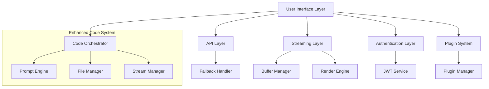

# Design Document

## Overview

This design addresses critical stability and functionality issues across the application by implementing robust error handling, enhanced streaming capabilities, responsive UI components, integrated code orchestration, complete authentication flows, and resilient plugin architecture. The solution focuses on creating a seamless user experience with proper fallbacks and consistent behavior across all components.

## Architecture

### High-Level Architecture



### Component Integration Strategy

The design integrates the existing enhanced-code-orchestrator.ts with the code-mode.tsx component through a unified interface that maintains consistency and safety in code operations while providing enhanced streaming capabilities.

## Components and Interfaces

### 1. API Reliability System

#### Enhanced API Client
```typescript
interface APIClient {
  request<T>(config: RequestConfig): Promise<APIResponse<T>>;
  withFallback<T>(primary: () => Promise<T>, fallback: () => Promise<T>): Promise<T>;
  withRetry<T>(operation: () => Promise<T>, options: RetryOptions): Promise<T>;
}

interface RequestConfig {
  url: string;
  method: 'GET' | 'POST' | 'PUT' | 'DELETE';
  data?: any;
  timeout?: number;
  retries?: number;
  fallbackEndpoints?: string[];
}

interface RetryOptions {
  maxAttempts: number;
  backoffStrategy: 'exponential' | 'linear' | 'fixed';
  baseDelay: number;
  maxDelay: number;
  jitter: boolean;
}
```

#### Fallback Management
- Primary/secondary endpoint routing
- Circuit breaker pattern implementation
- Health check monitoring
- Graceful degradation strategies

### 2. Enhanced Streaming System

#### Streaming Architecture
```typescript
interface StreamingManager {
  startStream(config: StreamConfig): Promise<StreamSession>;
  processChunk(sessionId: string, chunk: StreamChunk): void;
  handleError(sessionId: string, error: StreamError): void;
  completeStream(sessionId: string): Promise<StreamResult>;
}

interface StreamConfig {
  sessionId: string;
  bufferSize: number;
  chunkSize: number;
  renderThrottle: number;
  errorRecovery: boolean;
}

interface StreamChunk {
  content: string;
  metadata: ChunkMetadata;
  timestamp: number;
  sequence: number;
}
```

#### Rendering Pipeline
- Chunk buffering and coalescing
- Smooth animation transitions
- Backpressure handling
- Error recovery mechanisms

### 3. Responsive UI System

#### Message Bubble Component
```typescript
interface MessageBubbleProps {
  message: Message;
  maxWidth?: number;
  responsive?: boolean;
  overflow?: 'wrap' | 'scroll' | 'ellipsis';
}

interface ResponsiveConfig {
  breakpoints: {
    mobile: number;
    tablet: number;
    desktop: number;
  };
  sizing: {
    mobile: BubbleSizing;
    tablet: BubbleSizing;
    desktop: BubbleSizing;
  };
}
```

#### Layout Management
- Dynamic width calculation
- Content overflow handling
- Mobile-first responsive design
- Accessibility compliance

### 4. Code Integration System

#### Enhanced Code Orchestrator Integration
```typescript
interface CodeModeIntegration {
  orchestrator: EnhancedCodeOrchestrator;
  sessionManager: CodeSessionManager;
  diffHandler: DiffOperationHandler;
  safetyValidator: CodeSafetyValidator;
}

interface CodeSessionManager {
  createSession(config: CodeSessionConfig): Promise<string>;
  executeOperation(sessionId: string, operation: CodeOperation): Promise<CodeResult>;
  validateChanges(sessionId: string, changes: DiffOperation[]): Promise<ValidationResult>;
  applyChanges(sessionId: string, changes: DiffOperation[]): Promise<ApplyResult>;
}
```

#### Safety and Consistency
- Pre-execution validation
- Rollback mechanisms
- Change tracking
- Conflict resolution

### 5. Authentication System

#### Complete Auth Flow
```typescript
interface AuthenticationService {
  login(credentials: LoginCredentials): Promise<AuthResult>;
  register(userData: RegistrationData): Promise<AuthResult>;
  logout(): Promise<void>;
  refreshToken(): Promise<TokenResult>;
  validateSession(): Promise<boolean>;
}

interface AuthResult {
  success: boolean;
  user?: User;
  token?: string;
  error?: string;
}
```

#### UI Integration
- Modal-based auth forms
- State management
- Error handling
- Accessibility features

### 6. Plugin Architecture

#### Robust Plugin System
```typescript
interface PluginSystem {
  loadPlugin(pluginId: string): Promise<Plugin>;
  executePlugin(pluginId: string, input: any): Promise<PluginResult>;
  handlePluginError(pluginId: string, error: Error): Promise<void>;
  isolatePlugin(pluginId: string): void;
}

interface Plugin {
  id: string;
  name: string;
  version: string;
  dependencies: PluginDependency[];
  execute(input: any): Promise<any>;
  cleanup(): Promise<void>;
}
```

#### Error Isolation
- Plugin sandboxing
- Resource management
- Dependency validation
- Graceful failure handling

## Data Models

### Stream State Management
```typescript
interface StreamState {
  sessionId: string;
  status: 'initializing' | 'streaming' | 'paused' | 'completed' | 'error';
  buffer: StreamChunk[];
  renderQueue: string[];
  metrics: StreamMetrics;
  error?: StreamError;
}

interface StreamMetrics {
  totalChunks: number;
  averageChunkSize: number;
  renderLatency: number;
  errorCount: number;
  throughput: number;
}
```

### Code Operation Models
```typescript
interface CodeOperation {
  type: 'read' | 'write' | 'diff' | 'validate';
  files: FileReference[];
  changes?: DiffOperation[];
  options: OperationOptions;
}

interface DiffOperation {
  type: 'add' | 'remove' | 'modify';
  file: string;
  lineStart: number;
  lineEnd?: number;
  content: string;
  originalContent?: string;
  confidence: number;
}
```

### Plugin Data Models
```typescript
interface PluginState {
  id: string;
  status: 'loaded' | 'running' | 'error' | 'disabled';
  resources: ResourceUsage;
  dependencies: DependencyStatus[];
  lastError?: Error;
}

interface ResourceUsage {
  memory: number;
  cpu: number;
  networkRequests: number;
  storageUsed: number;
}
```

## Error Handling

### Centralized Error Management
```typescript
interface ErrorHandler {
  handleAPIError(error: APIError): Promise<ErrorResponse>;
  handleStreamError(error: StreamError): Promise<void>;
  handlePluginError(pluginId: string, error: Error): Promise<void>;
  handleUIError(component: string, error: Error): void;
}

interface ErrorResponse {
  handled: boolean;
  fallbackAction?: () => Promise<void>;
  userMessage?: string;
  retryable: boolean;
}
```

### Error Recovery Strategies
- Automatic retry with exponential backoff
- Fallback endpoint switching
- Graceful degradation
- User notification system
- State recovery mechanisms

## Testing Strategy

### Unit Testing
- Component isolation testing
- API client testing with mocks
- Streaming buffer management testing
- Plugin system testing
- Authentication flow testing

### Integration Testing
- End-to-end streaming scenarios
- Code orchestrator integration
- Plugin interaction testing
- Authentication state management
- UI responsiveness testing

### Performance Testing
- Streaming throughput benchmarks
- Memory usage monitoring
- Plugin resource consumption
- UI rendering performance
- Mobile device testing

### Error Scenario Testing
- Network failure simulation
- API timeout handling
- Plugin crash recovery
- Authentication token expiry
- Memory pressure testing

## Security Considerations

### Authentication Security
- JWT token management
- Secure storage practices
- Session timeout handling
- CSRF protection
- Input validation

### Code Execution Safety
- Sandbox execution environment
- Input sanitization
- File system access controls
- Resource usage limits
- Audit logging

### Plugin Security
- Plugin signature verification
- Resource access controls
- Network request filtering
- Data isolation
- Permission management

## Performance Optimizations

### Streaming Optimizations
- Adaptive chunk sizing
- Intelligent buffering
- Render throttling
- Memory management
- Connection pooling

### UI Performance
- Virtual scrolling for long conversations
- Lazy loading of components
- Memoization strategies
- Bundle size optimization
- Image optimization

### Plugin Performance
- Lazy plugin loading
- Resource pooling
- Caching strategies
- Background processing
- Memory cleanup

## Accessibility Features

### Screen Reader Support
- ARIA labels and descriptions
- Semantic HTML structure
- Keyboard navigation
- Focus management
- Live region updates

### Visual Accessibility
- High contrast mode
- Scalable text sizing
- Color blind friendly palettes
- Reduced motion options
- Clear visual hierarchy

### Motor Accessibility
- Large touch targets
- Keyboard shortcuts
- Voice input support
- Gesture alternatives
- Timeout extensions